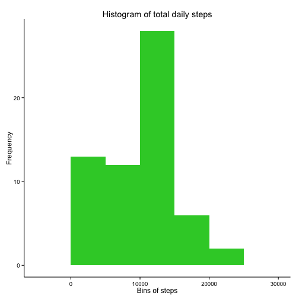
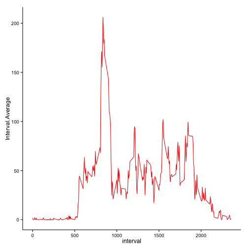
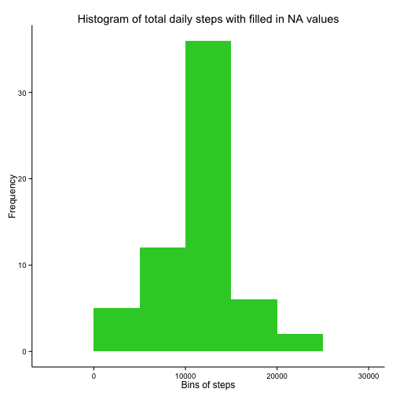
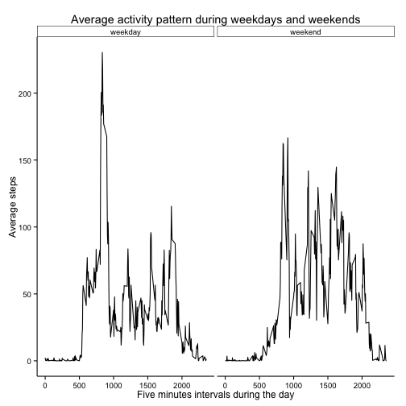

## Loading and preprocessing the data


```r
library(tidyr)
library(dplyr)
library(ggplot2)
library(lubridate)

df <- tbl_df(read.csv("activity.csv"))
```

## What is mean total number of steps taken per day?


```r
df.day <- df %>%
  group_by(date) %>%
  summarise(Day.Sum = sum(steps, na.rm=TRUE))
```

 


```r
df.day.summary <- df.day %>%
  summarise(Mean.total.steps=mean(Day.Sum, na.rm = TRUE), Median.total.steps=median(Day.Sum, na.rm = TRUE))
```

Mean and median of the total number of steps taken per day are 9354.23  &  10395, respectively

## What is the average daily activity pattern?


```r
df.interval <- df %>%
  group_by(interval) %>%
  summarise(Interval.Average = mean(steps, na.rm = TRUE))

daily.ac <- ggplot(df.interval, aes(interval, Interval.Average))+ 
  geom_line(color="red")+
  theme_classic()
daily.ac
```

 

### Which 5-minute interval, on average across all the days in the dataset, contains the maximum number of steps?


```r
interval <- df.interval$interval[which.max(df.interval$Interval.Average)]
```

## Imputing missing values

### Calculate and report the total number of missing values in the dataset


```r
na <- length(subset(df$steps, is.na(df$steps)==TRUE))
```

### Create a new dataset that is equal to the original dataset but with the missing data filled in


```r
df.interval <- df %>%
  group_by(interval) %>%
  summarise(Interval.Average = mean(steps, na.rm = TRUE))
na.values <- numeric()

for (i in 1:nrow(df)) {
  data <- df[i,]
  if(is.na(data$steps)) {
    steps <- subset(df.interval, interval == data$interval)$Interval.Average
    } else {steps <- data$steps}
  na.values <- c(na.values, steps)
}

# Create a new dataset that is equal to the original dataset but with the missing data filled in.

df.new <- df
df.new$steps <- na.values
```

### Make a histogram of the total number of steps taken each day 


```r
df.day.n <- df.new %>%
  group_by(date) %>%
  summarise(Day.Sum = sum(steps))

## New histogram

hist2 <-ggplot(df.day.n, aes(Day.Sum))+ 
  geom_histogram(binwidth=5000, fill="limegreen")+
  labs(title = "Histogram of total daily steps with filled in NA values", y = "Frequency", x = "Bins of steps")+ 
  theme_classic()
hist2
```

 

### Calculate and report the mean and median total number of steps taken per day. 


```r
df.day.summary.n <- df.day.n %>%
  summarise(Mean.total.steps=mean(Day.Sum, na.rm = TRUE), Median.total.steps=median(Day.Sum, na.rm = TRUE))
```

Do these values differ from the estimates from the first part of the assignment? 

Yes they do

Mean got increased. Mean and median now have the same values after filling NAs with mean values. New mean and mean are: 10766.19  &  10766.19, respectively.

## Are there differences in activity patterns between weekdays and weekends?


```r
df.new$date <- ymd(df.new$date) 
df.new <- mutate(df.new, Days=weekdays(date))
df.new <- df.new %>% group_by(interval, Days) %>% summarise(Average=mean(steps))
weekpart <- NULL
for (i in 1:nrow(df.new)) {
  data <- df.new[i,]
  if (data$Days == "Sunday" | data$Days == "Saturday") {
    week <- "weekend"}
  else {
    week <- "weekday"
  }
  weekpart <- c(weekpart, week)
  }
df.new$Week <- factor(weekpart)
df.new.averaged <- df.new %>% group_by(interval, Week) %>% summarise(Average=mean(Average))

week.activity <- ggplot(df.new.averaged, aes(interval, Average), color=Week)+ 
  geom_line()+
  facet_grid(facets=.~Week)+
labs(title = "Average activity pattern during weekdays and weekends", y = "Average steps", x = "Five minutes intervals during the day")+  
theme_classic()
week.activity
```

 

There are differences in activity between weekdays and weekends.
